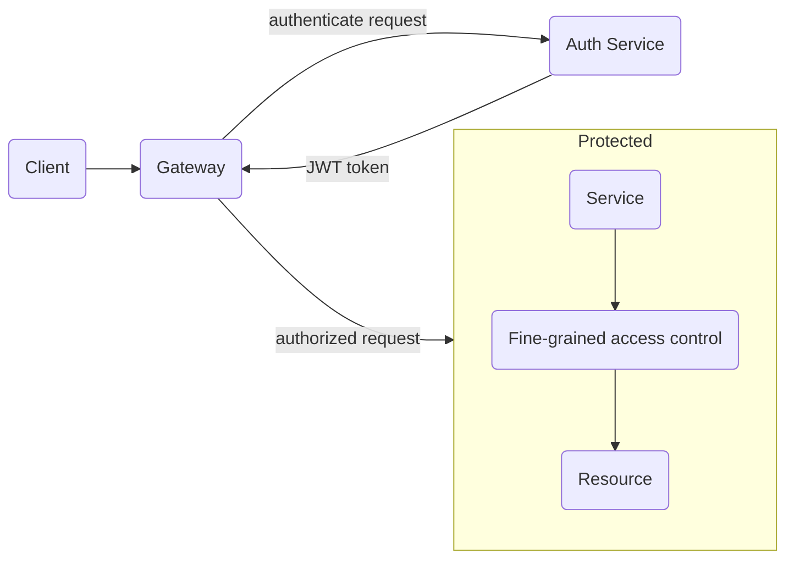

# go-attr-rbac

A simple hybrid of ABAC & RBAC that delegates fine-graining to downstream services.

```mermaid
flowchart LR
    C(Client) --> G(Gateway) -- authenticate request --> A(Auth Service)
    
    subgraph Protected
        direction TB
        S(Service) --> FG(Fine-grained access control)
        FG --> R(Resource)
    end

    A -- JWT token --> G -- authorized request --> Protected
```
