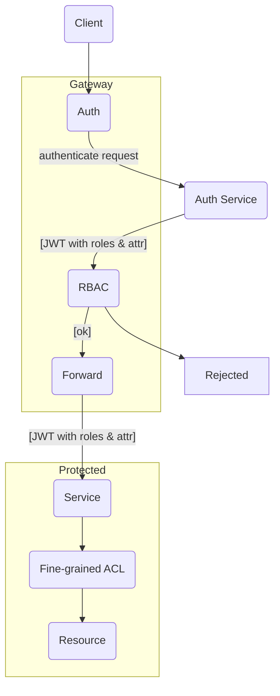

# go-attr-rbac

A simple hybrid of ABAC & RBAC that delegates fine-graining to downstream services.

## Usage

### Use as a program

Just clone/download the repo, build and run it.

### Use as a library

Start with the `main.go` from this package and modify it to your needs. The bulk of stuff is in
`api/handlers`, and the `ent` directory are database stuff as usual.

#### Migrations

It is deliberately left out migrations as the server do some database checking while starting up.
